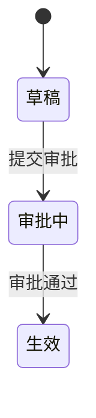
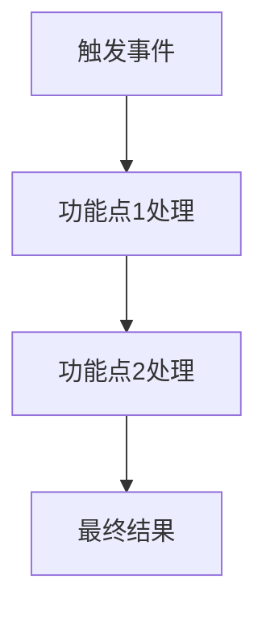
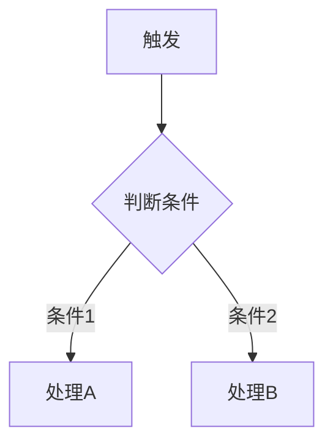

# PRD文档标准模板

本文档提供完整的PRD（产品需求文档）标准模板。创作PRD时,根据实际需求选择性使用或调整模板中的章节。

## 核心结构原则

1. **功能点自包含**：每个功能点是一个完整的、自包含的单元。读者看完一个功能点，就能完整理解该功能，无需跳转到其他章节。
2. **流程图分层**：整体业务流程（跨功能点的架构级流程）放在功能点列表之前；功能内部的流程紧跟功能描述，作为该功能的认知地图。
3. **首次定义 + 后续引用**：跨功能共享的规则在首次出现的功能点中完整定义，后续功能点用章节链接引用。核心概念（3.1）仅放术语定义和前置知识（状态机、实体关系等），不堆积业务规则。
4. **认知递进**：业务逻辑按主流程 → 分支流程 → 边界与异常的顺序组织，符合读者从正常情况到特殊情况的认知路径。
5. **可读性优先**：PRD 需要与团队伙伴分享、与开发讨论，结构要便于快速定位和理解。写作风格参见 `references/PRD-WRITING-STYLE.md`。

---

## 文档信息

| 项目 | 内容 |
|------|------|
| 文档名称 | [产品名称] PRD |
| 文档版本 | V1.0 |
| 文档作者 | [作者姓名] |
| 创建日期 | YYYY-MM-DD |
| 最后更新 | YYYY-MM-DD |
| 文档状态 | 草稿/评审中/已批准 |
| 项目优先级 | P0/P1/P2 |

### 更新记录

| 版本 | 日期 | 作者 | 更新内容 |
|------|------|------|----------|
| V1.0 | YYYY-MM-DD | [姓名] | 初稿 |

---

## 1. 需求概述

### 1.1 需求背景

**业务背景**
- 当前业务现状
- 面临的问题或挑战（用具体场景说明，避免空泛描述）

**需求来源**
- 用户反馈/数据分析/战略规划/...

### 1.2 产品目标

**用户目标**
- 为用户解决什么问题？带来什么价值？

**商业目标**（如适用）
- 支持哪些战略目标？预期商业价值？

**目标用户**
- 主要目标用户画像及规模

### 1.3 产品范围

**本期范围（MVP）**
- 功能点1（详见 [3.x](#)）
- 功能点2（详见 [3.x](#)）
- 功能点3（详见 [3.x](#)）

> 建议：每个功能点用一句话概括，并链接到第3章对应章节，方便快速导航。

**不在范围内**
- 明确不做的功能

**依赖条件**
- 依赖的系统、数据或技术前置条件

---

## 2. 市场与用户分析

> 本章节适用于新产品或大型项目。小功能/功能优化PRD可省略。

### 2.1 竞品分析

| 竞品名称 | 核心功能 | 优势 | 劣势 | 差异化点 |
|---------|---------|------|------|---------|
| 竞品A | xxx | xxx | xxx | xxx |

**竞品对比结论**
- 我们的差异化优势
- 可以学习借鉴的地方

### 2.2 用户研究

**用户画像**（如适用）

| 用户类型 | 行为特征 | 核心诉求 | 占比 |
|---------|---------|---------|------|
| [类型A] | [特征] | [诉求] | XX% |

---

## 3. 功能需求

### 3.1 核心概念

> 本章节定义跨功能点的共性概念，为后续功能点提供统一的语境。如不涉及新概念，可省略。

**核心实体**（如适用）

| 实体名称 | 说明 | 与其他实体的关系 |
|---------|------|-----------------|
| [实体A] | [说明] | [关系] |

**状态流转**（如适用）

**术语表**（如适用）

| 术语 | 定义 |
|------|------|
| [术语1] | [明确定义] |

### 3.2 整体流程

> 本章节放置**跨功能点的架构级流程图**——帮助读者理解整个需求的全貌和各功能点之间的关系。
> 如果需求只有一个功能点，或功能点之间没有流程关联，可省略本章节。
> **功能点内部的判断/处理流程不放这里**，放在对应功能点章节内。

### 3.3 功能点1：[功能名称]

> 每个功能点是一个**自包含的完整单元**，读者看完就能完整理解该功能。

#### 功能描述

[一段话说明这个功能做什么、为谁服务。**第一句话必须是该功能的核心要点**。]

#### 功能内流程

> 仅在该功能点内部有复杂判断/处理逻辑时需要。紧跟功能描述，帮助读者建立该功能的整体认知地图，再进入界面细节和业务规则。

#### 界面与交互

> 仅在涉及新增或修改页面时需要。

**页面修改**（适用于修改现有页面）
- 页面路径：[访问路径]
- 修改区域：[具体区域]
- 变更内容：[新增/修改/删除的元素]

**新增页面**（适用于新建页面）
- 页面入口：[从哪里进入]
- 整体布局：[布局结构描述]
- 关键元素：[列出关键UI元素]

**交互说明**

| 操作 | 说明 |
|------|------|
| [操作1] | [触发行为和反馈] |
| [操作2] | [触发行为和反馈] |

#### 业务逻辑

> 按认知递进顺序组织：主流程 → 分支流程 → 边界与异常。规则按关注点分组（如显示与权限、核心行为、配置项等），不用扁平编号表格。异常处理融入「边界与异常」组，不单独成节。
>
> 如果某条规则是跨功能共享的且本功能点是首次出现，在此完整定义。后续功能点用链接引用，不重复完整描述。

**[主流程规则]**
- [正常路径下的核心行为和规则]

**[分支/条件规则]**（如有）
- [条件分支、特殊配置、角色差异处理]

**边界与异常**
- [异常场景]：[系统行为]，[用户提示]

**存量数据兼容**（仅在涉及数据结构变更时需要）
- 存量数据处理策略：[说明]
- 是否需要迁移脚本：是/否

#### 验收标准

> 只写不能从业务逻辑直接推导的验证点。规则中已明确的内容不在此复述。

- [ ] 验收点1：[需要专门验证的场景或边界]
- [ ] 验收点2：[需要专门验证的场景或边界]

---

### 3.4 功能点2：[功能名称]

> 按照功能点1的结构继续，每个功能点自包含。根据实际情况裁剪子章节——没有复杂内部逻辑就不写"功能内流程"，没有UI变更就不写"界面与交互"，没有数据变更就不写"存量数据兼容"。跨功能共享的规则如果已在前面的功能点中完整定义，此处用链接引用即可。

[...]

---

### 3.N 权限配置推导

> 本章节适用于 SaaS/B端系统，根据功能逻辑自动推导所需的权限配置变更。如不涉及权限变动，可省略。

**菜单变更**

| 操作 | 菜单名称 | 菜单路径 | 说明 |
|------|---------|---------|------|
| 新增/修改/删除 | [菜单名] | [父菜单 > 子菜单] | [说明] |

**功能点变更**

| 操作 | 功能点名称 | 所属菜单 | 功能描述 |
|------|-----------|---------|---------|
| 新增/修改/删除 | [功能点名] | [所属菜单] | [具体功能] |

**数据权限变更**（如适用）

| 权限类型 | 变更内容 | 影响范围 | 说明 |
|---------|---------|---------|------|
| 行权限/列权限 | [变更] | [影响角色] | [说明] |

---

## 4. 非功能需求

> 本章节适用于中大型项目。小功能PRD可省略。

### 4.1 性能要求

- 页面加载时间：≤ 2秒
- 接口响应时间：≤ 500ms
- 并发量/数据量预期

### 4.2 安全性要求

- 数据安全、访问控制等

### 4.3 兼容性要求

- 系统/设备/浏览器兼容性

---

## 5. 数据埋点与指标

> 本章节适用于需要数据驱动的功能。小功能PRD可省略。

### 5.1 核心指标

| 指标名称 | 定义 | 目标值 | 监控周期 |
|---------|------|--------|---------|
| [指标1] | [计算方式] | [目标] | 日/周/月 |

### 5.2 数据埋点

| 事件名称 | 触发条件 | 埋点字段 | 说明 |
|---------|---------|---------|------|
| [事件1] | [条件] | [字段] | [说明] |

---

## 6. 技术方案概述

> 本章节适用于技术PRD或需要前后端协同设计的场景。纯产品PRD可省略。

### 6.1 技术架构

[架构图或技术选型说明]

### 6.2 接口设计

| 接口名称 | 接口地址 | 请求方式 | 说明 |
|---------|---------|---------|------|
| [接口1] | /api/xxx | GET/POST | [说明] |

---

## 7. 项目规划

> 本章节适用于中大型项目。小功能PRD可省略。

### 7.1 里程碑计划

| 里程碑 | 交付物 | 负责人 | 预计完成时间 |
|--------|--------|--------|-------------|
| 需求评审 | PRD文档 | [产品] | YYYY-MM-DD |
| 开发完成 | 功能代码 | [开发] | YYYY-MM-DD |
| 测试完成 | 测试报告 | [测试] | YYYY-MM-DD |

### 7.2 风险与应对

| 风险描述 | 可能性 | 影响程度 | 应对措施 |
|---------|--------|---------|---------|
| [风险1] | 高/中/低 | 高/中/低 | [方案] |

---

## 附录

### 名词解释

| 术语 | 解释 |
|------|------|
| [术语1] | [说明] |

### 参考资料

- [相关文档/链接]

---

## 模板使用指南

### 章节裁剪建议

**小功能PRD**（<5人天）
- 必须保留：需求概述(1)、功能需求(3)
- 可省略：市场分析(2)、非功能需求(4)、数据埋点(5)、技术方案(6)、项目规划(7)

**中等功能PRD**（5-20人天）
- 必须保留：需求概述(1)、功能需求(3)、权限配置推导(3.N)
- 建议保留：非功能需求(4)、项目规划(7)
- 可简化：市场分析(2)

**大型项目PRD**（>20人天）
- 使用完整模板，可能需要拆分为多个子PRD

**SaaS/B端功能PRD**
- 强化：核心概念(3.1)、权限配置推导(3.N)、存量数据兼容
- 每个功能点的业务逻辑必须包含「边界与异常」组

### 功能点章节裁剪

每个功能点**不需要写全所有子章节**，按实际情况裁剪：

| 子章节 | 何时需要 |
|--------|---------|
| 功能描述 | **始终需要**。第一句话是该功能的核心要点 |
| 功能内流程 | 有复杂判断/处理逻辑时。紧跟描述，帮助建立整体认知 |
| 界面与交互 | 涉及新增/修改页面时 |
| 业务逻辑 | **始终需要**。按主流程→分支→边界与异常的认知递进顺序组织 |
| 验收标准 | **始终需要**。只写不能从业务逻辑直接推导的验证点 |
